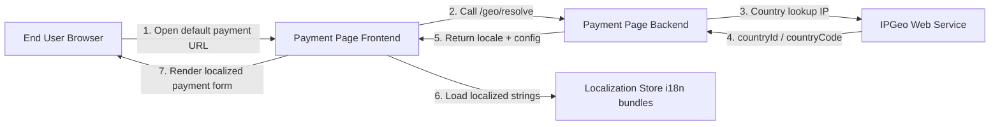
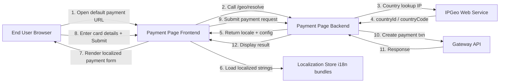

## Country Specific Page (IPGeo)

```mermaid
flowchart LR
  U[End User Browser] -->|1. Open default payment URL| FE[Payment Page Frontend]
  FE -->|2. Call /geo/resolve| BE[Payment Page Backend]
  BE -->|3. Country lookup IP| IPG[IPGeo Web Service]
  IPG -->|4. countryId / countryCode| BE
  BE -->|5. Return locale + config| FE
  FE -->|6. Load localized strings| I18N[Localization Store i18n bundles]
  FE -->|7. Render localized payment form| U
```

## With Payment Submission

```mermaid
flowchart LR
  U["End User Browser"] -->|1. Open default payment URL| FE["Payment Page Frontend"]
  FE -->|2. Call /geo/resolve| BE["Payment Page Backend"]
  BE -->|3. Country lookup IP| IPG["IPGeo Web Service"]
  IPG -->|4. countryId / countryCode| BE
  BE -->|5. Return locale + config| FE
  FE -->|6. Load localized strings| I18N["Localization Store i18n bundles"]
  FE -->|7. Render localized payment form| U

  U -->|8. Enter card details + Submit| FE
  FE -->|9. Submit payment request| BE
  BE -->|10. Create payment txn| GW["Gateway API"]
  GW -->|11. Response| BE
  BE -->|12. Display result| FE
```
