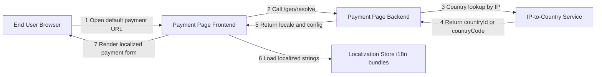
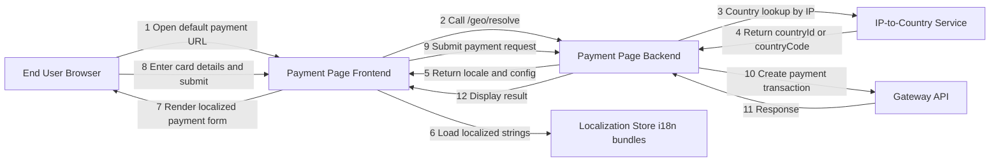

# Country-Specific Payment Page (IP-to-Country Lookup)

**Disclaimer:** Vendor-neutral reference diagram for portfolio purposes.  
No proprietary assessment prompts or confidential company information is included.

## Goal
Serve a payment page in the user’s local language by resolving country from IP and loading the appropriate i18n bundle.

## Entities (high level)
- **End User Browser**
- **Payment Page Frontend**
- **Payment Page Backend**
- **IP-to-Country Service** (3rd-party geo lookup)
- **Localization Store** (i18n bundles / translations)
- *(Optional)* **Gateway API** (if the page submits payments)

## Flow notes
- The backend should resolve country using the client IP (more reliable than browser-only).
- Language is selected via a simple country→locale mapping, with **English fallback**.
- If lookup fails, fallback to **English** and allow a manual language selector.
- Cache country results briefly to reduce dependency on the external geo service.
- Avoid logging sensitive payment data on the client or in URL parameters.

### Fallback and safety notes
- Preferred language: `Accept-Language` (if provided) → else geo-based locale → else English.
- If geo lookup fails, show English + allow manual language selection.
- Avoid exposing internal geo errors to end users; use generic messages and fallback behavior.
- Log only non-sensitive context (country/locale), and never log card details.
  
---

## Localization Only (no payment submission)

## With Payment Submission (end-to-end)

