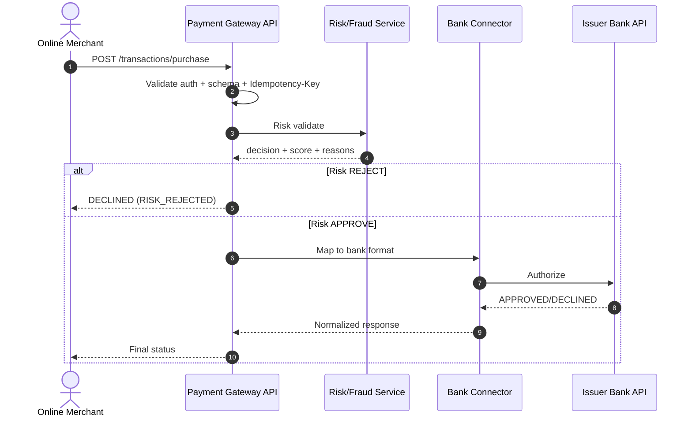
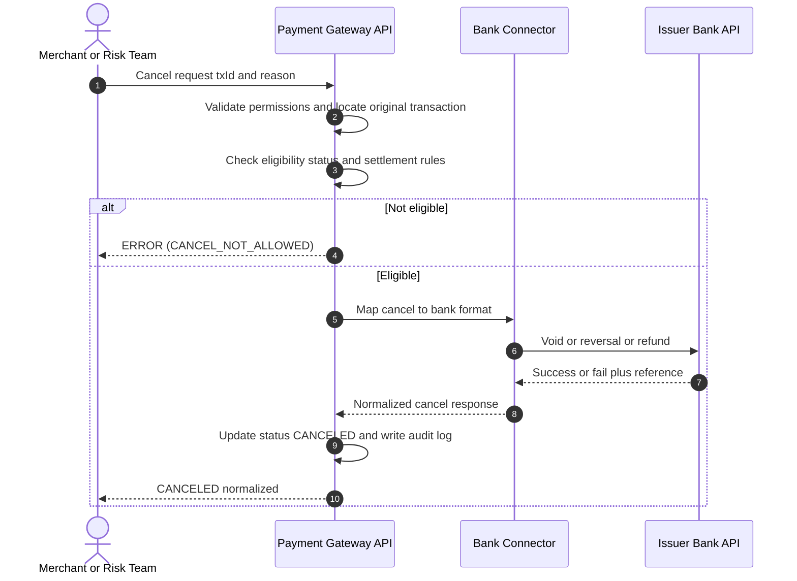
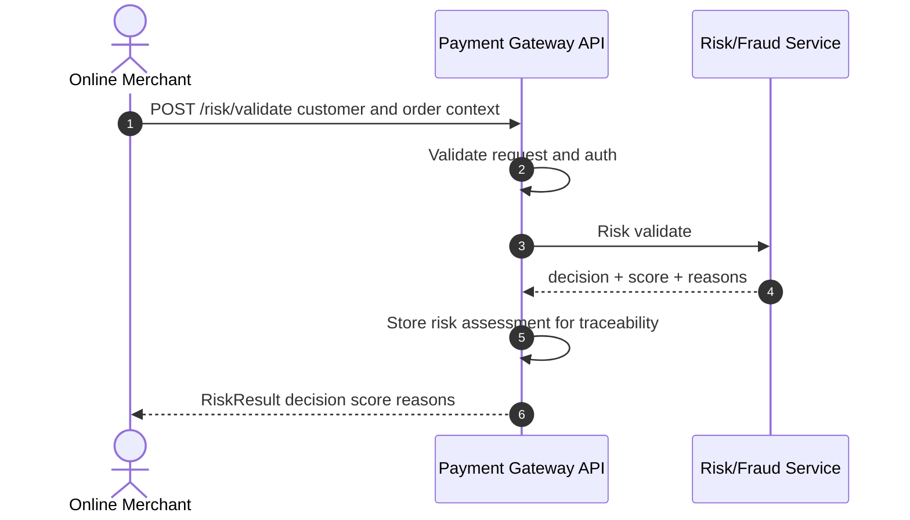

# Reference Design: Secure Payment Gateway (Portfolio / Learning)

This repository contains a vendor-neutral reference design for a payment gateway system.
It focuses on **secure-by-design thinking**, auditability, and operational supportability—based on my engineering + IT security experience in regulated environments.

## Contents
- **Transaction flows (Purchase / Cancellation / Risk Check)** with short explanations
- **General tasks**: localization via IP-based country lookup, spec outline, and multi-language error messages (see `General-Task.md`)

## Disclaimer
This is an educational, vendor-neutral portfolio artifact.
It does **not** include proprietary assessment prompts, internal documentation, confidential information, or production system details from any company.

## Security testing relevance
These flows highlight common pentest focus areas: authorization boundaries (RBAC/BOLA), business-logic/state validation, error handling, and audit logging.
---
## Purchase Flow

**Purpose:** Process a payment request end-to-end and return a consistent result to the merchant.

**What happens (high level):**
- Merchant sends a purchase request to the gateway
- Gateway validates the request (auth + required fields)
- Gateway performs a risk/fraud check (external or internal)
- If allowed, gateway routes to a bank connector and sends the authorization request
- Gateway returns a **normalized** response (Approved/Declined)

**Security/ops notes (why this matters):**
- **Idempotency-Key** prevents duplicate charges during retries/timeouts (common in real production systems)
- **Correlation ID + audit trail** supports incident investigations and audits
- No sensitive card data is stored (tokenization assumed)

## Purchase Flow Diagram

---
## Cancellation Flow

**Purpose:** Allow a merchant or risk team to cancel a previous transaction (policy-based) and record an audit trail.

**What happens (high level):**
- Cancel request is submitted with transactionId + reason
- Gateway checks permission and eligibility (status/time/settlement rules)
- If eligible, gateway calls the bank connector for void/reversal/refund
- Gateway updates status to **CANCELED** and logs who/when/why
- Returns a normalized cancellation response

**Security/ops notes:**
- Cancellation is a sensitive action → requires **RBAC** and **mandatory reason**
- Full **status history** and **audit log** reduce investigation time
  
## Cancellation Flow Diagram

---
## Standalone Risk Validation

**Purpose:** Evaluate user/transaction context to prevent fraud attempts and support safer payment decisions.

**What happens (high level):**
- Merchant requests risk validation with customer + order context
- Gateway validates request and calls risk/fraud service
- Risk service returns decision/score/reasons
- Gateway stores the risk assessment for traceability
- Gateway returns the risk result

**Security/ops notes:**
- Risk outputs should be traceable for review/audit
- Responses should use **stable codes** (machine-friendly) + **messages** (human-friendly)
## Standalone Risk Validation Diagram

## Risk Team Console (Wireframe)

*Figure: Vendor-neutral Risk Team Console for review + cancel with audit trail.*

---

## Notes on “Multi-bank” Support (simple concept)

Different banks can expose different APIs. A common pattern is to use a **Bank Connector (Adapter)** layer:
- The gateway keeps a consistent internal transaction model
- Each connector maps the standard request/response to a specific bank format
- This keeps merchant integration stable even when banks differ
- Routing can be based on country, merchant configuration, or bank availability.

